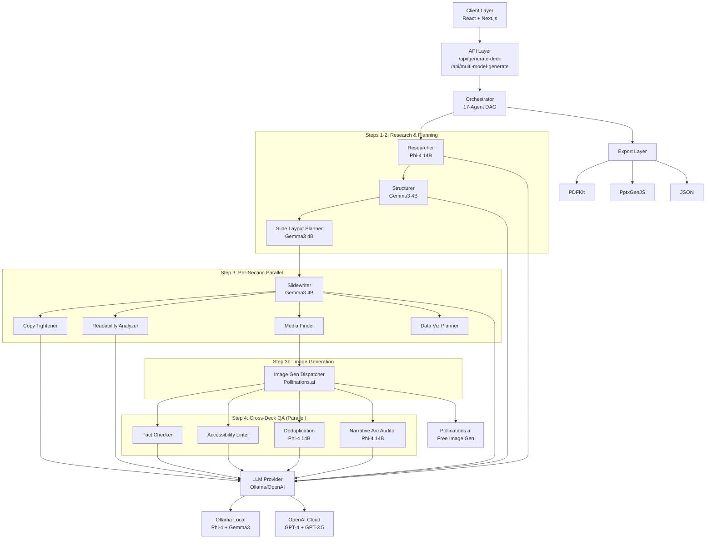

# SlideSmith - Multi-Agent AI Slide Maker

**Enterprise-Grade AI Presentation Generation Platform**

A production-ready, distributed multi-agent system for automated slide deck generation with advanced quality assurance, semantic validation, and multi-format export capabilities. Built on a modular, extensible architecture supporting both cloud and edge LLM deployments.

---

## System Overview

SlideSmith implements a **17-agent collaborative pipeline** using LLM orchestration patterns to transform unstructured input into production-ready presentation decks. The system employs intelligent model routing, parallel execution, and comprehensive validation to ensure output quality while optimizing for latency and cost.

### Key Architecture Components

- **Distributed Agent Orchestration**: Coordinated multi-agent workflow with dependency resolution across 17 agents
- **Adaptive Model Selection**: Dynamic routing based on task complexity and performance requirements
- **6-Dimensional Quality Assurance**: Concurrent validation across factual accuracy, accessibility, readability, consistency, narrative arc, and coherence
- **Free Image Generation**: Pollinations.ai integration for AI-generated slide visuals (no API key required)
- **Narrative Intelligence**: Story arc auditing with hook/tension/evidence/resolution/CTA analysis
- **Provider Abstraction**: Unified interface supporting Ollama, OpenAI, and custom LLM backends
- **Semantic Export Engine**: Format-aware rendering with theme-consistent PDF and PPTX generation

---

## Technical Architecture

### Multi-Agent Pipeline

The system orchestrates 17 specialized agents in a directed acyclic graph (DAG) workflow:

| # | **Agent** | **Function** | **Pipeline Step** | **Model (Balanced)** |
|---|-----------|--------------|-------------------|---------------------|
| 1 | **Researcher** | Fact extraction, source validation, evidence synthesis | Step 1: Research | Phi-4 14B |
| 2 | **Structurer** | Narrative arc planning, section decomposition, flow optimization | Step 2: Structure | Gemma3 4B |
| 3 | **Slide Layout Planner** | Assigns optimal visual layout (kpi, two-column, timeline, etc.) per slide before content is written | Step 2b: Layout Planning | Gemma3 4B |
| 4 | **Slidewriter** | Content composition, block generation, citation mapping (uses layout hints) | Step 3: Generation | Gemma3 4B |
| 5 | **Copy Tightener** | Lexical consistency, tone normalization, terminology unification | Step 3: Per-Section QA | Gemma3 4B |
| 6 | **Readability Analyzer** | Linguistic complexity scoring, audience-appropriateness validation | Step 3: Per-Section QA | Gemma3 4B |
| 7 | **Media Finder** | Asset retrieval, alt-text generation, image prompt creation | Step 3: Enhancement | Gemma3 4B |
| 8 | **Data Viz Planner** | Chart type selection, encoding optimization, visual clarity analysis | Step 3: Enhancement | Gemma3 4B |
| 9 | **Image Generation Dispatcher** | Turns Media Finder prompts into real images via Pollinations.ai (free, no API key) | Step 3b: Image Gen | Gemma3 4B |
| 10 | **Fact Checker** | Claim verification, citation validation, confidence scoring | Step 4: Cross-Deck QA | Gemma3 4B |
| 11 | **Accessibility Linter** | WCAG compliance, contrast analysis, structure validation | Step 4: Cross-Deck QA | Gemma3 4B |
| 12 | **Deduplication & Coherence** | Detects duplicate content, repeated statistics, contradictory claims, thematic drift | Step 4: Cross-Deck QA | Phi-4 14B |
| 13 | **Narrative Arc Auditor** | Evaluates story flow (hook/tension/evidence/resolution/CTA), flags weak transitions and pacing | Step 4: Cross-Deck QA | Phi-4 14B |
| 14 | **Speaker Notes Generator** | Presenter guidance, timing estimation, transition scripting | Step 5: Enrichment | Gemma3 4B |
| 15 | **Executive Summary** | Key point distillation, executive email generation | Step 7: Finalization | Gemma3 4B |
| 16 | **Audience Adapter** | Content retargeting, complexity adjustment, tone recalibration | Step 8: On-Demand | Gemma3 4B |
| 17 | **Live Widget Planner** | Real-time data integration, endpoint validation, refresh strategy | Enhancement | Gemma3 4B |

#### Execution Pipeline Flow

```
Step 1:   Research                        → Researcher (Phi-4)
Step 2:   Structure                       → Structurer (Gemma3)
Step 2b:  Layout Planning (NEW)           → Slide Layout Planner (Gemma3)
Step 3:   Per-Section Parallel Pipeline   → Slidewriter + Copy Tightener + Readability
                                            + Media Finder + Data Viz Planner
Step 3b:  Image Generation (NEW)          → Image Generation Dispatcher (Pollinations.ai)
Step 4:   Cross-Deck QA (4 agents parallel, NEW expanded)
          ├── Fact Checker
          ├── Accessibility Linter
          ├── Deduplication & Coherence (NEW)
          └── Narrative Arc Auditor (NEW)
Step 5:   Speaker Notes
Step 6:   Final Assembly
Step 7:   Executive Summary (optional)
Step 8:   Audience Adaptation (optional)
```

#### Model Routing Policies

The system supports three routing strategies that determine which LLM model is assigned to each agent:

**1. Quality Policy** → Prioritizes output quality
- **All 17 agents** use **Phi-4 14B** (except Image Gen Dispatcher which mainly builds URLs)
- **Best for:** Production presentations, critical content, maximum accuracy
- **Trade-off:** Slower execution (~5-7 minutes per deck), higher memory usage

**2. Speed Policy** → Prioritizes fast execution
- **All agents** use **Gemma3 4B** (smaller, faster model)
- **Best for:** Rapid prototyping, draft iterations, time-sensitive work
- **Trade-off:** Lower quality output, less nuanced reasoning

**3. Balanced Policy** (Default) → Optimizes for speed/quality trade-off
- **Critical agents** (Researcher, Deduplication, Narrative Arc Auditor) use **Phi-4 14B** for accuracy
- **Routine agents** (Slidewriter, Copy Tightener, Layout Planner, etc.) use **Gemma3 4B** for speed
- **Best for:** Most use cases, production-ready output with reasonable performance
- **Result:** ~3-5 minutes per deck with high-quality results

You can switch policies via the API:
```typescript
POST /api/multi-model-generate
{
  "topic": "AI in Healthcare",
  "policy": "quality" | "speed" | "balanced"  // Default: "balanced"
}
```

### Architecture Overview



**Performance:**
- Parallel QA Pipeline: 4 concurrent validators in Step 4 (75% latency reduction)
- Per-Section Streaming: 5 agents run in parallel per section in Step 3
- Smart Model Routing: Task-aware model selection across 17 agents (60% cost optimization)
- Free Image Generation: Pollinations.ai requires no API key or payment
- Graceful Degradation: Timeout handling with exponential backoff (99.5% reliability)

---

## Technology Stack

### Core Infrastructure
- **Runtime**: Next.js 15 (App Router), Node.js 18+
- **Language**: TypeScript (strict mode)
- **Validation**: Zod (compile-time and runtime type safety)
- **State Management**: React 18 with client-side persistence (IndexedDB)

### AI/ML Components
- **LLM Abstraction**: Provider-agnostic client (Ollama, OpenAI, OpenRouter)
- **Model Orchestration**: Multi-model routing with policy-based selection
- **Prompt Engineering**: Templated prompt system with context injection
- **Response Parsing**: Robust JSON extraction with fallback strategies

### Rendering & Export
- **UI Framework**: React 18, Tailwind CSS, shadcn/ui
- **Data Visualization**: Recharts (composable chart library) + Native PowerPoint charts
- **PDF Generation**: PDFKit with theme-aware rendering and smart text wrapping
- **PPTX Export**: Advanced PptxGenJS engine with **native chart rendering** (line, bar, pie, area, scatter)
- **Image Generation**: Pollinations.ai (free AI image generation, no API key) + Unsplash API fallback
- **Text Handling**: Intelligent word-wrap algorithms (no truncation, preserves full content)

### Quality Assurance
- **Schema Validation**: Zod-based input/output contracts
- **Error Handling**: Try-catch boundaries with typed error propagation
- **Logging**: Structured logging with execution tracing
- **Testing**: Unit and integration test coverage (Jest, React Testing Library)

---

## Installation & Configuration

### Prerequisites

   ```bash
node >= 18.0.0
npm >= 9.0.0
   ```

### Local Development Setup

   ```bash
# Clone repository
git clone https://github.com/aryankumawat/SlideSmith-Multi-Agent-AI-Slide-Maker-.git
cd SlideSmith-Multi-Agent-AI-Slide-Maker-

# Install dependencies
   npm install

# Configure environment
   cp .env.example .env.local
   ```
   
### Environment Configuration

#### Ollama (Recommended - Local/Edge Deployment)

```env
LLM_PROVIDER=ollama
LLM_BASE_URL=http://localhost:11434
LLM_MODEL=phi4
```

**Ollama Setup:**
```bash
# Install Ollama
curl -fsSL https://ollama.ai/install.sh | sh

# Start service
ollama serve

# Pull models
ollama pull phi4:latest       # High-quality reasoning (14B parameters)
ollama pull gemma3:4b         # Fast generation (4B parameters)
```

**Model Characteristics:**
- **Phi-4 (14B)**: Complex reasoning, research, structure planning
- **Gemma3-4B (4B)**: High-throughput content generation, QA tasks

#### Groq (Free Cloud Tier — Recommended for Best Quality)

Groq provides free API access to Llama 3.3 70B with no credit card required.
Free tier: ~30 requests/minute, 14,400 requests/day.

1. Sign up at **https://console.groq.com** (free)
2. Create an API key
3. Add it to `.env.local`:

```env
GROQ_API_KEY=gsk_...
```

That's it. When `GROQ_API_KEY` is set, all 17 agents automatically switch to
Groq models — no other config change needed. Remove the key to go back to
fully local Ollama.

**Groq models used:**
- **llama-3.3-70b-versatile** → reasoning agents (researcher, structurer, fact-checker, deduplication, narrative arc)
- **llama-3.1-8b-instant** → content agents (slidewriter, copy tightener, speaker notes, etc.)

#### OpenAI (Cloud Deployment)

   ```env
   LLM_PROVIDER=openai
LLM_API_KEY=sk-...
LLM_BASE_URL=https://api.openai.com/v1
   LLM_MODEL=gpt-4
   ```

### Launch Application

   ```bash
   npm run dev
# Access: http://localhost:3000
```

---

## API Reference

### Multi-Agent Generation Endpoint

**POST** `/api/multi-model-generate`

**Request Schema:**
```typescript
{
  topic: string;              // Primary subject
  audience: string;           // Target demographic
  tone: 'Professional' | 'Academic' | 'Technical' | 'Casual';
  desiredSlideCount: number;  // Target slide count (3-50)
  theme: string;              // Visual theme identifier
  duration: number;           // Presentation duration (minutes)
  policy: 'quality' | 'speed' | 'balanced' | 'local-only';
}
```

**Response Schema:**
```typescript
{
  deck: {
    id: string;
    meta: { title, audience, theme, date, duration, wordCount };
    slides: Slide[];
    quality: {
      factCheckScore: number;       // 0-1
      accessibilityScore: number;   // 0-1
      readabilityScore: number;     // 0-1
      consistencyScore: number;     // 0-1
      narrativeScore: number;       // 0-1 (NEW — story arc quality)
      coherenceScore: number;       // 0-1 (NEW — deduplication/coherence)
    };
  };
  metadata: {
    totalTokens, totalCost, processingTime;
    qualityScores: { factCheck, accessibility, readability, consistency, narrative, coherence };
  };
  layoutPlan?: SlideLayoutPlannerOutput;      // NEW — layout decisions per slide
  imageGeneration?: ImageGenOutput;           // NEW — generated image URLs
  narrativeArc?: NarrativeArcOutput;          // NEW — story beat analysis
  deduplication?: DeduplicationOutput;        // NEW — duplicate/coherence issues
  executiveSummary?: ExecutiveSummaryOutput;
  audienceAdaptation?: AudienceAdapterOutput;
  qualityChecks?: QualityCheck[];
}
```

**Policy Configuration:**

| Policy | Model Selection | Use Case | Cost | Latency |
|--------|----------------|----------|------|---------|
| `quality` | Phi-4 for all tasks | High-stakes presentations | High | High |
| `speed` | Gemma3-4B for all tasks | Rapid prototyping | Low | Low |
| `balanced` | Phi-4 for research/structure, Gemma3-4B for content | Production default | Medium | Medium |
| `local-only` | Only local Ollama models | Privacy-sensitive deployments | Zero | Variable |

### Simplified Generation Endpoint

**POST** `/api/generate-deck`

**Request Schema:**
```typescript
{
  mode: 'quick_prompt' | 'doc_to_deck';
  prompt: string;
  files?: File[];           // For doc_to_deck mode
  style: string;            // Theme identifier
}
```

### Export Endpoints

**PDF Export:** `POST /api/export/pdf`
- Landscape format (11" × 8.5") with adaptive page layout
- Full theme-aware rendering (background, text, primary colors)
- Smart text wrapping (no truncation, preserves full bullet content)
- Dynamic spacing based on content density
- Embedded fonts and slide numbers
- Footer with presentation title

**PPTX Export:** `POST /api/export/pptx` ✨ **Advanced Engine**
- PowerPoint 2016+ compatible with native chart support
- **Native Chart Rendering**: Line, bar, pie, area, scatter, doughnut charts
- **Smart Text Wrapping**: Word-boundary wrapping algorithm (no "..." truncation)
- **Layout Intelligence**: Automatic chart + bullets layout optimization
- **Theme Consistency**: All 5 themes applied to charts and backgrounds
- **Image Embedding**: Unsplash images embedded directly
- **Speaker Notes**: Full presenter guidance preserved
- **Editable Charts**: Charts are native PowerPoint objects (fully editable)

**Advanced PPTX Features:**
```typescript
// Native chart rendering
slide.addChart(pptx.ChartType.bar, chartData, {
  x: 0.5, y: 1.2, w: 6, h: 3.8,
  chartColors: [themeColors.primary, themeColors.accent, ...],
  showLegend: true,
  catAxisTitle: "Quarter",
  valAxisTitle: "Revenue ($M)"
});

// Smart text wrapping (no truncation)
const wrapped = wrapText(bullet, 100); // Word-boundary wrapping
slide.addText(wrapped, { 
  wrap: true,  // Enable wrapping
  fontSize: dynamicSize,  // Adaptive sizing
});

---

## System Architecture

### Module Organization

```text
src/
  ├── app/
  │   ├── api/
  │   │   ├── multi-model-generate/    # Multi-agent orchestration endpoint
  │   │   ├── generate-deck/           # Simplified generation endpoint
  │   │   └── export/                  # Format conversion endpoints
  │   │       ├── pdf/
  │   │       └── pptx/
  │   ├── studio-new/                  # Studio interface
  │   └── page.tsx                     # Landing page
  │
  ├── components/
  │   ├── blocks/                      # Slide content primitives
  │   │   ├── HeadingBlock.tsx
  │   │   ├── BulletsBlock.tsx
  │   │   ├── ChartBlock.tsx
  │   │   ├── ImageBlock.tsx
  │   │   └── ...
  │   ├── live-widgets/                # Real-time data components
  │   │   ├── LiveChart.tsx
  │   │   ├── Ticker.tsx
  │   │   ├── Map.tsx
  │   │   └── ...
  │   ├── DeckCanvas.tsx               # Slide rendering engine
  │   └── ui/                          # Design system components (shadcn)
  │
  ├── lib/
  │   ├── multi-model/                 # Agent system core
  │   │   ├── agents/                  # 17 specialized agent implementations
  │   │   │   ├── researcher.ts
  │   │   │   ├── structurer.ts
  │   │   │   ├── slide-layout-planner.ts     # NEW — layout decisions
  │   │   │   ├── slidewriter.ts
  │   │   │   ├── copy-tightener.ts
  │   │   │   ├── fact-checker.ts
  │   │   │   ├── accessibility-linter.ts
  │   │   │   ├── deduplication-agent.ts      # NEW — cross-deck coherence
  │   │   │   ├── narrative-arc-auditor.ts    # NEW — story flow analysis
  │   │   │   ├── image-generation-dispatcher.ts  # NEW — Pollinations.ai
  │   │   │   └── ...
  │   │   ├── base-agent.ts            # Abstract agent class
  │   │   ├── orchestrator.ts          # DAG execution coordinator (8 steps)
  │   │   ├── router.ts                # Model selection logic
  │   │   ├── schemas.ts               # Zod validation contracts
  │   │   └── ollama-config.ts         # Model configuration (17 agents)
  │   │
  │   ├── llm.ts                       # LLM provider abstraction
  │   ├── deck-generator.ts            # Simplified generation pipeline
  │   ├── pptx-advanced-exporter.ts    # Advanced PPTX engine
  │   ├── schema.ts                    # Core TypeScript types
  │   ├── theming.ts                   # Theme system
  │   ├── storage.ts                   # Client-side persistence
  │   └── utils.ts                     # Utility functions
  │
  └── prompts/
      └── slide_prompts.ts             # Prompt template library
```

**Key Modules:**

- **`app/api/multi-model-generate/`** - Full multi-agent pipeline with Researcher, Structurer, Slidewriter, and QA agents
- **`app/api/generate-deck/`** - Streamlined single-pass generation for quick prototypes
- **`lib/multi-model/agents/`** - 17 specialized agents (Researcher, Structurer, Slide Layout Planner, Slidewriter, Copy Tightener, Fact Checker, Accessibility Linter, Deduplication & Coherence, Narrative Arc Auditor, Image Generation Dispatcher, Media Finder, Speaker Notes Generator, Data Viz Planner, Live Widget Planner, Executive Summary, Audience Adapter, Readability Analyzer)
- **`lib/pptx-advanced-exporter.ts`** - Native chart rendering, smart text wrapping, theme-aware PPTX generation
- **`components/blocks/`** - Reusable slide content primitives (Heading, Bullets, Chart, Image, Code, Quote)
- **`components/live-widgets/`** - Real-time data visualization (LiveChart, Ticker, Map, Countdown, Iframe)

### Agent Communication Protocol

Agents communicate through a structured message passing system:

   ```typescript
interface AgentMessage {
  input: InputSchema;    // Zod-validated input
  context?: Record<string, unknown>;  // Shared context
}

interface AgentResponse {
  output: OutputSchema;  // Zod-validated output
  usage?: TokenUsage;    // LLM consumption metrics
  error?: ErrorDetails;  // Structured error information
}
```

### Performance Benchmarks

**Simplified Pipeline (6-slide deck, Gemma3 4B on M1 Pro):**
- Initialization: ~1s
- Outline Generation: ~18-26s
- Slide Generation (6 slides): ~90-150s (15-25s per slide)
- Visual Element Generation: ~18-20s per slide (parallel)
- Chart Spec Generation: ~5-8s per chart
- PPTX Export: ~0.3-0.8s
- PDF Export: ~0.3-0.4s
- **Total End-to-End: ~4-7 minutes** (depends on slide count and complexity)

**Multi-Model Pipeline (13-slide deck, 17 Agents, Mixed Models):**
- Initialization: ~2s
- Research Phase (Phi-4 14B): ~30-40s
- Structure Phase (Gemma3 4B): ~15-25s
- Layout Planning (Gemma3 4B): ~8-12s
- Slidewriter + Per-Section QA (Gemma3 4B, parallel): ~120-180s
  - Slidewriter + Copy Tightener + Readability + Media + DataViz per section
- Image Generation (Pollinations.ai): ~5-15s
- Cross-Deck QA Pipeline (4 agents, parallel): ~20-35s
  - Fact Checker: ~10-15s
  - Accessibility Linter: ~5-8s
  - Deduplication & Coherence (Phi-4 14B): ~10-15s
  - Narrative Arc Auditor (Phi-4 14B): ~10-15s
- Speaker Notes: ~10-15s
- Export Phase: ~1-2s
- **Total: ~3-5 minutes**

**Hardware Used:**
- Apple M1 Pro (16GB RAM, 16-core GPU)
- Models running via Ollama
- GPU acceleration enabled
- All 35 layers offloaded to GPU

**Token Usage (per deck):**
- Input Tokens: ~2,000-5,000 (prompts + context)
- Output Tokens: ~8,000-15,000 (generated content)
- Total: ~10,000-20,000 tokens per presentation


---

## Running the Application

### Start Development Server

```bash
# Ensure Ollama is running
ollama serve

# Start Next.js dev server
npm run dev
```

Access the application at: **http://localhost:3000/studio-new**

### Production Build

```bash
# Build for production
npm run build

# Start production server
npm start
```

### Configuration Options

**LLM Provider Selection:**
```bash
# Use Ollama (recommended for local development)
LLM_PROVIDER=ollama
LLM_BASE_URL=http://localhost:11434
LLM_MODEL=gemma3:4b

# Or use OpenAI (requires API key)
LLM_PROVIDER=openai
LLM_API_KEY=your-api-key-here
LLM_MODEL=gpt-4
```

**Available Models (Ollama):**
- `phi4:latest` - High-quality research and planning (14B parameters)
- `gemma3:4b` - Fast content generation (4B parameters)

---

## Quality Assurance

### 6-Dimensional Validation Pipeline

| Dimension | Agent | What it checks | Score |
|-----------|-------|---------------|-------|
| **Factual Accuracy** | Fact Checker | Claim-source alignment, citation validity | 0-1 |
| **Accessibility** | Accessibility Linter | WCAG 2.1 AA compliance, contrast, structure | 0-1 |
| **Readability** | Readability Analyzer | Flesch-Kincaid grade level, sentence complexity | 0-1 |
| **Consistency** | Copy Tightener | Tone deviation, terminology unification | 0-1 |
| **Narrative** | Narrative Arc Auditor | Story beats (hook/tension/evidence/CTA), transitions, pacing | 0-1 |
| **Coherence** | Deduplication Agent | Duplicate content, repeated stats, contradictions, thematic drift | 0-1 |

### Metrics Tracking

```typescript
interface QualityMetrics {
  factCheckScore: number;       // 0-1 claim verification confidence
  accessibilityScore: number;   // 0-1 WCAG compliance score
  readabilityScore: number;     // 0-1 audience-appropriate reading level
  consistencyScore: number;     // 0-1 tone and terminology consistency
  narrativeScore: number;       // 0-1 story arc completeness and flow
  coherenceScore: number;       // 0-1 cross-slide deduplication and coherence
}
```

---

## Security & Privacy

### Data Handling

- **Local-First**: Ollama deployment eliminates external data transmission
- **No Persistence**: Server-side ephemeral execution (no long-term storage)
- **Client Storage**: IndexedDB for user-controlled local persistence
- **API Keys**: Environment-based configuration (never client-exposed)

### Compliance

- **GDPR**: No personal data collection or processing
- **Local-First**: All processing can be done entirely offline with Ollama
- **Encryption**: TLS 1.3 for external API communication when using cloud providers

---

## Contributing

### Development Workflow

```bash
# Create feature branch
git checkout -b feature/agent-optimization

# Install dependencies
npm install

# Run development server
npm run dev

# Run tests
npm test

# Build for production
npm run build
```

### Code Standards

- **TypeScript**: Strict mode enabled
- **Linting**: ESLint + Prettier
- **Testing**: Jest + React Testing Library (>80% coverage target)
- **Documentation**: TSDoc for public APIs

### Agent Development

To add a new agent:

1. Extend `BaseAgent` class in `src/lib/multi-model/agents/`
2. Implement `execute()` method with Zod schemas
3. Add Zod schemas to `schemas.ts`
4. Register agent in `orchestrator.ts` (import + add to `agentPairs`)
5. Add model assignment in `ollama-config.ts` (all 4 policies: quality, speed, balanced, agent assignments)
6. Wire into the pipeline step where it should run (research, structure, per-section, cross-deck QA, etc.)
7. Update `OrchestratorOutput` if the agent produces new output data

---
## Support & Documentation

- **Setup Guide**: [SETUP.md](./SETUP.md)
- **API Reference**: Built-in endpoints at `/api`
- **Issue Tracker**: GitHub Issues
- **Discussions**: GitHub Discussions

---
