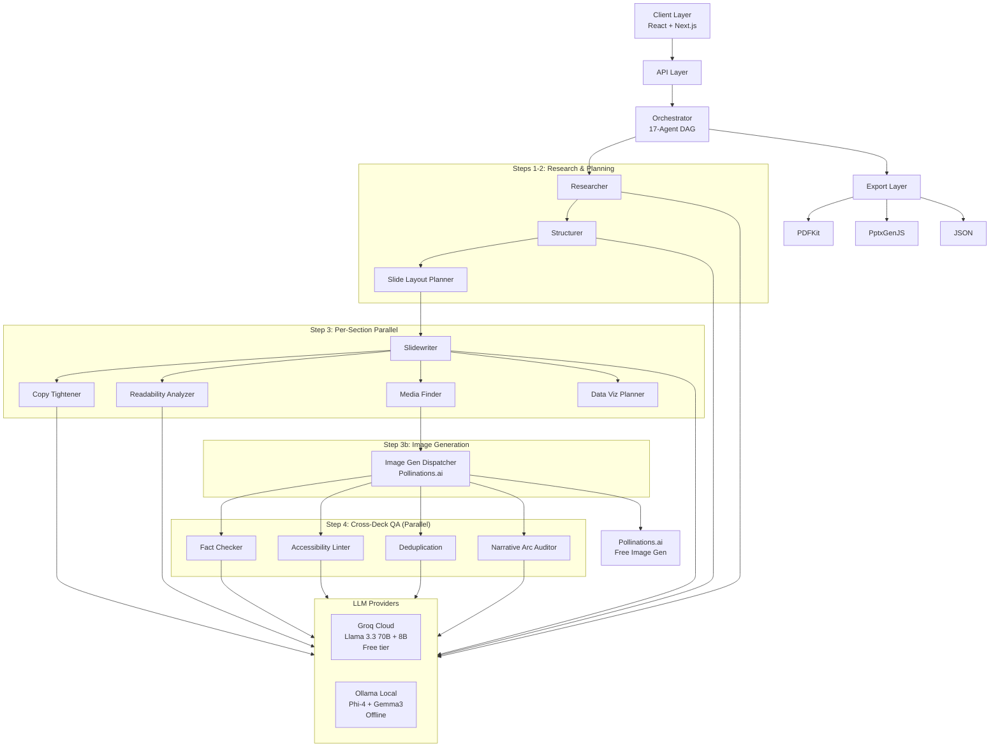

# SlideSmith — Multi-Agent AI Slide Maker

**Enterprise-Grade AI Presentation Generation Platform**

A production-ready, distributed multi-agent system for automated slide deck generation with advanced quality assurance, semantic validation, and multi-format export. Runs fully locally with Ollama or against the cloud for free with Groq — zero API cost required.

---

## Quick Start

```bash
# 1. Clone and install
git clone https://github.com/aryankumawat/SlideSmith-Multi-Agent-AI-Slide-Maker-.git
cd SlideSmith-Multi-Agent-AI-Slide-Maker-
npm install

# 2. Configure (copy the template, then edit)
cp .env.local.example .env.local

# 3. Start
npm run dev
# → http://localhost:3000/studio
```

**Choose your model backend (edit `.env.local`):**

| Option | Setup | Quality | Cost |
|--------|-------|---------|------|
| **Groq** (recommended) | Free account at console.groq.com, paste key | Llama 3.3 70B | Free |
| **Ollama** (local/offline) | `ollama pull phi4:latest && ollama pull gemma3:4b` | Phi-4 14B + Gemma3 | Free |

---

## System Overview

SlideSmith implements a **17-agent collaborative pipeline** using LLM orchestration to transform unstructured input into production-ready presentation decks. It supports three model backends:

- **Groq** — free cloud tier (Llama 3.3 70B + 8B), gated on `GROQ_API_KEY`
- **Ollama** — fully local, no internet required (Phi-4 14B + Gemma3 4B)
- **OpenAI-compatible** — any provider with `/v1/chat/completions` endpoint

When `GROQ_API_KEY` is present in `.env.local`, all agents automatically prefer Groq. Remove the key to fall back entirely to Ollama.

---

## Architecture

### 17-Agent Pipeline

| # | Agent | Function | Step | Model (Balanced) |
|---|-------|----------|------|-----------------|
| 1 | **Researcher** | Fact extraction, source validation, evidence synthesis | Step 1 | groq-llama-3.3-70b / phi4 |
| 2 | **Structurer** | Narrative arc planning, section decomposition | Step 2 | groq-llama-3.3-70b / phi4 |
| 3 | **Slide Layout Planner** | Assigns optimal visual layout per slide before writing | Step 2b | groq-llama-3.1-8b / gemma3 |
| 4 | **Slidewriter** | Content composition, block generation, citation mapping | Step 3 | groq-llama-3.1-8b / gemma3 |
| 5 | **Copy Tightener** | Lexical consistency, tone normalisation | Step 3 | groq-llama-3.1-8b / gemma3 |
| 6 | **Readability Analyzer** | Linguistic complexity scoring, audience validation | Step 3 | groq-llama-3.1-8b / gemma3 |
| 7 | **Media Finder** | Asset retrieval, alt-text generation, image prompts | Step 3 | groq-llama-3.1-8b / gemma3 |
| 8 | **Data Viz Planner** | Chart type selection, encoding optimisation | Step 3 | groq-llama-3.1-8b / gemma3 |
| 9 | **Image Generation Dispatcher** | Turns prompts into images via Pollinations.ai (free, no key) | Step 3b | — |
| 10 | **Fact Checker** | Claim verification, citation validation, confidence scoring | Step 4 | groq-llama-3.3-70b / phi4 |
| 11 | **Accessibility Linter** | WCAG compliance, contrast analysis, structure validation | Step 4 | groq-llama-3.1-8b / gemma3 |
| 12 | **Deduplication & Coherence** | Detects duplicate content, contradictions, thematic drift | Step 4 | groq-llama-3.3-70b / phi4 |
| 13 | **Narrative Arc Auditor** | Story flow (hook/tension/evidence/resolution/CTA) | Step 4 | groq-llama-3.3-70b / phi4 |
| 14 | **Speaker Notes Generator** | Presenter guidance, timing, transition scripting | Step 5 | groq-llama-3.1-8b / gemma3 |
| 15 | **Executive Summary** | Key point distillation, executive email generation | Step 7 | groq-llama-3.1-8b / gemma3 |
| 16 | **Audience Adapter** | Content retargeting, complexity adjustment, tone recalibration | Step 8 | groq-llama-3.1-8b / gemma3 |
| 17 | **Live Widget Planner** | Real-time data integration, endpoint validation | Enhancement | groq-llama-3.1-8b / gemma3 |

#### Execution Flow

```
Step 1:   Research             → Researcher (high-quality model)
Step 2:   Structure            → Structurer (high-quality model)
Step 2b:  Layout Planning      → Slide Layout Planner
Step 3:   Per-Section Parallel → Slidewriter + Copy Tightener + Readability
                                  + Media Finder + Data Viz Planner
Step 3b:  Image Generation     → Image Generation Dispatcher (Pollinations.ai)
Step 4:   Cross-Deck QA ×4     → Fact Checker + Accessibility Linter
                                  + Deduplication & Coherence + Narrative Arc Auditor
Step 5:   Speaker Notes
Step 6:   Final Assembly
Step 7:   Executive Summary (optional)
Step 8:   Audience Adaptation (optional)
```

#### Model Routing Policies

| Policy | High-Quality Model | Fast Model | Use Case |
|--------|--------------------|------------|----------|
| `balanced` (default) | Reasoning agents → groq-llama-3.3-70b | Content agents → groq-llama-3.1-8b | Best for most workloads |
| `quality` | All agents → groq-llama-3.3-70b | — | Maximum accuracy |
| `speed` | — | All agents → groq-llama-3.1-8b | Rapid drafts |

_All Groq models fall back to Phi-4 / Gemma3 when `GROQ_API_KEY` is not set._

```typescript
// Switch policy per request
POST /api/multi-model-generate
{ "topic": "...", "policy": "quality" | "speed" | "balanced" }
```

#### Architecture Diagram



---

## Installation & Configuration

### Prerequisites

```
Node.js >= 18
npm >= 9
```

### Environment Setup

Copy the template and choose your backend:

```bash
cp .env.local.example .env.local
```

**Option A — Groq (free cloud, recommended):**

```env
# Ollama base config (still needed for non-Groq fallback)
LLM_PROVIDER=ollama
LLM_API_KEY=ollama
LLM_BASE_URL=http://localhost:11434
LLM_MODEL=gemma3:4b

# Add your free Groq key → all 17 agents switch to Groq automatically
GROQ_API_KEY=gsk_...
```

Get a free key at [console.groq.com](https://console.groq.com) — no credit card.  
Free tier: ~30 req/min, 14 400 req/day for Llama 3.3 70B.

**Option B — Ollama (local, no internet):**

```env
LLM_PROVIDER=ollama
LLM_API_KEY=ollama
LLM_BASE_URL=http://localhost:11434
LLM_MODEL=gemma3:4b
```

```bash
# Pull models
ollama pull phi4:latest    # 14B — research, structure, QA
ollama pull gemma3:4b      # 4B  — content generation
ollama serve
```

**Option C — OpenAI-compatible:**

```env
LLM_PROVIDER=openai
LLM_API_KEY=sk-...
LLM_BASE_URL=https://api.openai.com/v1
LLM_MODEL=gpt-4o
```

### Run

```bash
npm run dev     # Development → http://localhost:3000/studio
npm run build   # Production build (zero TypeScript errors)
npm start       # Production server
```

---

## API Reference

### Multi-Agent Generation

**POST** `/api/multi-model-generate`

```typescript
// Request
{
  topic: string;
  audience?: string;
  tone?: 'Professional' | 'Academic' | 'Technical' | 'Casual';
  desiredSlideCount?: number;   // 3–50
  theme?: string;
  duration?: number;            // minutes
  policy?: 'quality' | 'speed' | 'balanced';
  generateExecutiveSummary?: boolean;
  targetAudience?: string;
  targetDuration?: number;
}

// Response
{
  deck: {
    id: string;
    title: string;
    slides: Slide[];
    quality: {
      factCheckScore: number;       // 0–1
      accessibilityScore: number;   // 0–1
      readabilityScore: number;     // 0–1
      consistencyScore: number;     // 0–1
      narrativeScore: number;       // 0–1
      coherenceScore: number;       // 0–1
    };
  };
  metadata: {
    totalTokens: number;
    processingTime: number;
  };
  executiveSummary?: ExecutiveSummaryOutput;
  audienceAdaptation?: AudienceAdapterOutput;
}
```

### Legacy Generation

**POST** `/api/generate`

```typescript
{
  topic: string;
  detail?: string;
  tone?: string;
  audience?: string;
  length?: number;
  theme?: string;
  enableLive?: boolean;
  mode?: 'plan' | 'execute';
}
```

### Export

| Endpoint | Format | Notes |
|----------|--------|-------|
| `POST /api/export/pdf` | PDF | Landscape, theme-aware, smart text wrapping |
| `POST /api/export/pptx` | PowerPoint | Native charts, editable objects, speaker notes |

---

## Project Structure

```
src/
├── app/
│   ├── api/
│   │   ├── multi-model-generate/   # 17-agent pipeline endpoint
│   │   ├── generate/               # Simplified generation endpoint
│   │   └── export/pdf|pptx/        # Export endpoints
│   ├── studio/                     # Main editor UI
│   └── page.tsx                    # Landing page
│
├── components/
│   ├── blocks/                     # Slide content primitives
│   │   ├── HeadingBlock.tsx
│   │   ├── BulletsBlock.tsx
│   │   ├── ChartBlock.tsx
│   │   ├── ImageBlock.tsx
│   │   ├── CodeBlock.tsx
│   │   └── QuoteBlock.tsx
│   ├── DeckCanvas.tsx              # Slide rendering engine
│   └── ui/                         # shadcn/ui components
│
└── lib/
    ├── multi-model/                 # Agent system
    │   ├── agents/                  # 17 agent implementations
    │   │   ├── researcher.ts
    │   │   ├── structurer.ts
    │   │   ├── slide-layout-planner.ts
    │   │   ├── slidewriter.ts
    │   │   ├── copy-tightener.ts
    │   │   ├── fact-checker.ts
    │   │   ├── accessibility-linter.ts
    │   │   ├── deduplication-agent.ts
    │   │   ├── narrative-arc-auditor.ts
    │   │   ├── image-generation-dispatcher.ts
    │   │   ├── media-finder.ts
    │   │   ├── speaker-notes-generator.ts
    │   │   ├── data-viz-planner.ts
    │   │   ├── live-widget-planner.ts
    │   │   ├── executive-summary.ts
    │   │   ├── audience-adapter.ts
    │   │   └── readability-analyzer.ts
    │   ├── base-agent.ts            # Abstract agent base class
    │   ├── orchestrator.ts          # DAG execution (8 steps)
    │   ├── router.ts                # Model selection logic
    │   ├── schemas.ts               # Zod v4 validation contracts
    │   └── ollama-config.ts         # Groq + Ollama model configs
    │
    ├── schema.ts                    # Core TypeScript types
    ├── theming.ts                   # 10-theme design system
    ├── storage.ts                   # IndexedDB persistence
    ├── executor.ts                  # Legacy pipeline executor
    ├── slidewriter.ts               # Legacy slide builder
    └── content-verifier.ts          # Content quality checks
```

---

## Adding a New Agent

1. Create `src/lib/multi-model/agents/<name>.ts` — extend `BaseAgent`, implement `execute()`
2. Define input/output Zod schemas in `schemas.ts`
3. Register in `orchestrator.ts` (import + add to `agentPairs`)
4. Add model assignment in `ollama-config.ts` (all four policy maps)
5. Wire into the appropriate pipeline step in the orchestrator

---

## Quality Assurance

### 6-Dimensional Validation

| Dimension | Agent | Checks |
|-----------|-------|--------|
| **Factual Accuracy** | Fact Checker | Claim-source alignment, citation validity |
| **Accessibility** | Accessibility Linter | WCAG 2.1 AA, contrast, structure |
| **Readability** | Readability Analyzer | Flesch-Kincaid grade, sentence complexity |
| **Consistency** | Copy Tightener | Tone deviation, terminology drift |
| **Narrative** | Narrative Arc Auditor | Hook/tension/evidence/CTA, pacing |
| **Coherence** | Deduplication Agent | Duplicate content, contradictions |

### TypeScript

The codebase compiles with **zero TypeScript errors** (`npx tsc --noEmit`). Strict mode is enabled.

---

## Tech Stack

| Layer | Technology |
|-------|-----------|
| Framework | Next.js 15 (App Router), React 19 |
| Language | TypeScript (strict) |
| Validation | Zod v4 |
| Styling | Tailwind CSS, shadcn/ui |
| Charts | Recharts |
| PDF Export | PDFKit |
| PPTX Export | PptxGenJS (native charts) |
| Image Gen | Pollinations.ai (free, no key) |
| Storage | IndexedDB (client-side) |
| LLM (cloud) | Groq — Llama 3.3 70B / 8B (free tier) |
| LLM (local) | Ollama — Phi-4 14B / Gemma3 4B |

---

## Security & Privacy

- **Local-first**: Ollama deployment keeps all data on your machine
- **No server storage**: All processing is ephemeral server-side
- **Client persistence**: IndexedDB, user-controlled
- **Secrets**: API keys stay in `.env.local` (gitignored), never sent to the client

---

## Performance

**Multi-Model Pipeline (13 slides, Balanced policy, Groq):**
- Research + Structure: ~15–25s
- Layout Planning: ~5–8s
- Per-section parallel (5 agents): ~60–90s
- Image Generation (Pollinations.ai): ~5–15s
- Cross-Deck QA (4 agents parallel): ~15–25s
- Speaker Notes: ~8–12s
- **Total: ~2–3 minutes**

**Ollama on Apple M1 Pro 16GB:**
- Same pipeline takes ~3–5 minutes
- GPU acceleration via Metal (all layers offloaded)

---

## License

MIT
